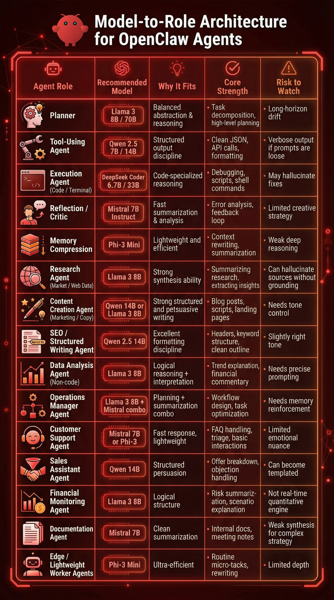

# Designing a Stable Autonomous AI Agent Using Free Local Models

> Your autonomous AI agent isn't failing because the model is too weak.\
> It's failing because the architecture is wrong.

This guide shows How to select and design the Autonomous AI Agent in OpenClaw using **Free Local AI Models on Ollama**

No expensive APIs.\
No monolithic supermodel.\
Just proper role assignment.

> Checkout the video version here: 

------------------------------------------------------------------------

# Core Principle

Serious autonomous systems are **not single superminds**.

They are layered stacks with: 
- Clear cognitive boundaries
- Minimal responsibility overlap
- Controlled feedback loops

------------------------------------------------------------------------

# The Four Core Roles of an Autonomous Agent

1.  Planner\
2.  Tool-Using Agent\
3.  Execution Agent\
4.  Reflection Layer

------------------------------------------------------------------------

## 1️⃣ Planner (Strategy Layer)

**Purpose:** Convert high-level goals into actionable steps.

Responsibilities: - Decompose goals - Identify dependencies - Sequence
tool invocations - Define priorities - Maintain strategic coherence

------------------------------------------------------------------------

## 2️⃣ Tool-Using Agent (Formatting Layer)

**Purpose:** Convert reasoning into precise machine-readable execution
instructions.

Responsibilities: - Generate valid JSON - Format tool calls - Provide
correct arguments - Maintain strict output discipline

------------------------------------------------------------------------

## 3️⃣ Execution Agent (Terminal Layer)

**Purpose:** Interact with real systems.

Responsibilities: - Read logs - Fix errors - Generate shell commands -
Edit files - Modify code

------------------------------------------------------------------------

## 4️⃣ Reflection Layer (Feedback Stabilization)

**Purpose:** Convert execution outcomes into structured learning.

Responsibilities: - Evaluate plan vs outcome - Identify failure points -
Summarize logs - Extract lessons - Update memory

------------------------------------------------------------------------

# Practical Model Assignment (Ollama)

## Planner → Llama 3 (8B / 70B)

``` bash
ollama run llama3:8b
```

## Tool-Using Agent → Qwen 2.5 (7B / 14B)

``` bash
ollama run qwen2.5:7b
```

## Execution Agent → DeepSeek Coder (6.7B / 33B)

``` bash
ollama run deepseek-coder:6.7b
```

## Reflection Layer → Mistral 7B Instruct

``` bash
ollama run mistral:7b-instruct
```

## Memory Compression → Phi-3 Mini

``` bash
ollama run phi3:mini
```

------------------------------------------------------------------------

# Example Stack Architecture

User Goal\
↓\
Planner (Llama 3)\
↓\
Tool Agent (Qwen 2.5)\
↓\
Execution Agent (DeepSeek Coder)\
↓\
Reflection (Mistral 7B)\
↓\
Memory Compression (Phi-3)\
↺ Loop

------------------------------------------------------------------------

# Architectural Takeaway

Autonomous AI scales through: 
- Specialization 
- Orchestration 
- Feedback loops 
- Memory control

Power does not come from placing the smartest model everywhere.

It comes from placing the correct model in the correct position.

------------------------------------------------------------------------

# 🧠 Full Model-to-Role Architecture Table

This table defines recommended placement inside OpenClaw.

| Agent Role                                    | Recommended Model              | Why It Fits                              | Core Strength                             | Risk to Watch                             |
| --------------------------------------------- | ------------------------------ | ---------------------------------------- | ----------------------------------------- | ----------------------------------------- |
| **Planner (Strategy Layer)**                  | **Llama 3 8B / 70B**           | Balanced abstraction & reasoning         | Task decomposition, high-level planning   | Long-horizon drift                        |
| **Tool-Using Agent**                          | **Qwen 2.5 7B / 14B**          | Structured output discipline             | Clean JSON, API calls, formatting         | Verbose output if prompts are loose       |
| **Execution Agent (Code / Terminal)**         | **DeepSeek Coder 6.7B / 33B**  | Code-specialized reasoning               | Debugging, scripts, shell commands        | May hallucinate fixes                     |
| **Reflection / Critic**                       | **Mistral 7B Instruct**        | Fast summarization & analysis            | Error analysis, feedback loop             | Limited creative strategy                 |
| **Memory Compression**                        | **Phi-3 Mini**                 | Lightweight and efficient                | Context rewriting, summarization          | Weak deep reasoning                       |
| **Research Agent (Market / Web Data)**        | **Llama 3 8B**                 | Strong synthesis ability                 | Summarizing research, extracting insights | Can hallucinate sources without grounding |
| **Content Creation Agent (Marketing / Copy)** | **Qwen 14B or Llama 3 8B**     | Strong structured and persuasive writing | Blog posts, scripts, landing pages        | Needs tone control                        |
| **SEO / Structured Writing Agent**            | **Qwen 2.5 14B**               | Excellent formatting discipline          | Headers, keyword structure, clean outline | Slightly rigid tone                       |
| **Data Analysis Agent (Non-code)**            | **Llama 3 8B**                 | Logical reasoning + interpretation       | Trend explanation, financial commentary   | Needs precise prompting                   |
| **Operations Manager Agent**                  | **Llama 3 8B + Mistral combo** | Planning + summarization combo           | Workflow design, task optimization        | Needs memory reinforcement                |
| **Customer Support Agent**                    | **Mistral 7B or Phi-3**        | Fast response, lightweight               | FAQ handling, triage, basic interactions  | Limited emotional nuance                  |
| **Sales Assistant Agent**                     | **Qwen 14B**                   | Structured persuasion                    | Offer breakdown, objection handling       | Can become templated                      |
| **Financial Monitoring Agent**                | **Llama 3 8B**                 | Logical structure                        | Risk summarization, scenario explanation  | Not real-time quantitative engine         |
| **Documentation Agent**                       | **Mistral 7B**                 | Clean summarization                      | Internal docs, meeting notes              | Weak synthesis for complex strategy       |
| **Edge / Lightweight Worker Agents**          | **Phi-3 Mini**                 | Ultra-efficient                          | Routine micro-tasks, rewriting            | Limited depth                             |

Image Version

<p align="center">
  
</p>
